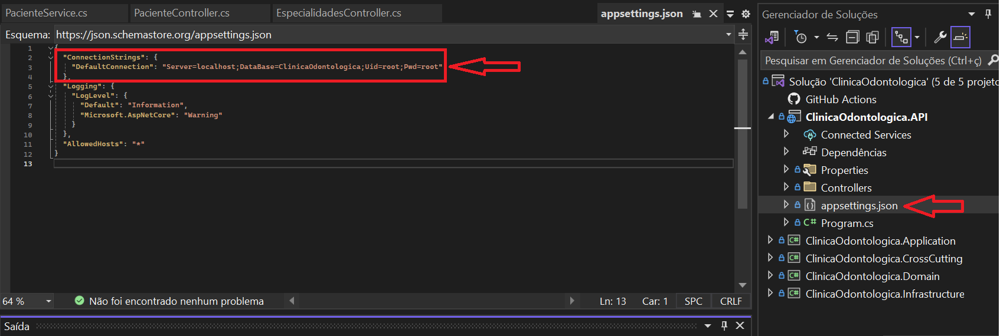
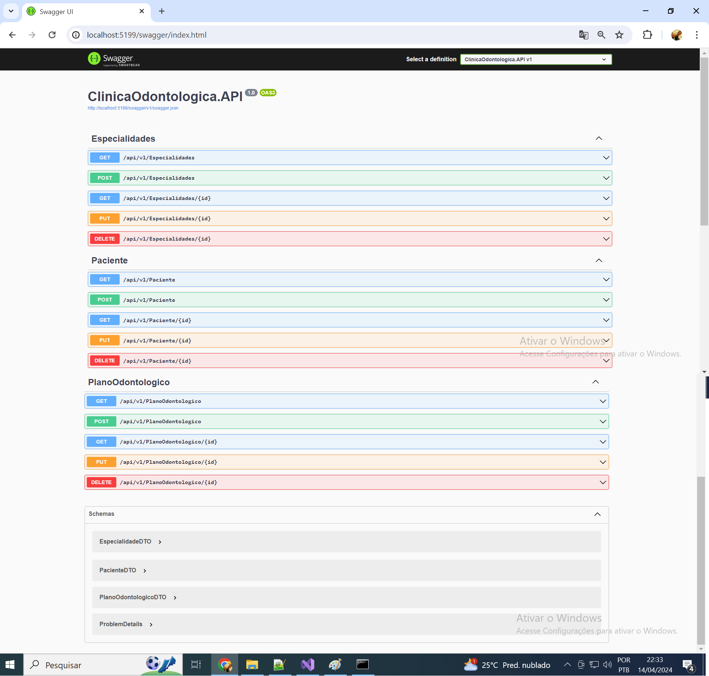
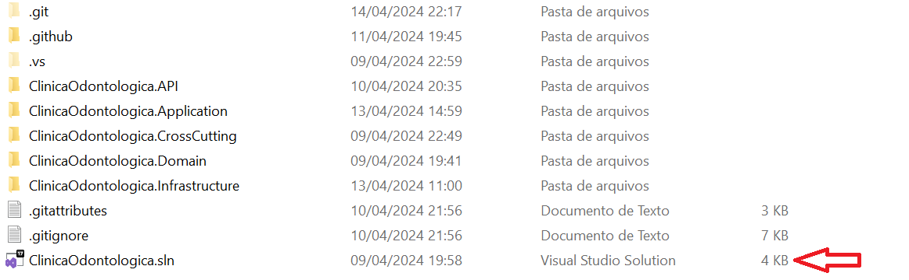
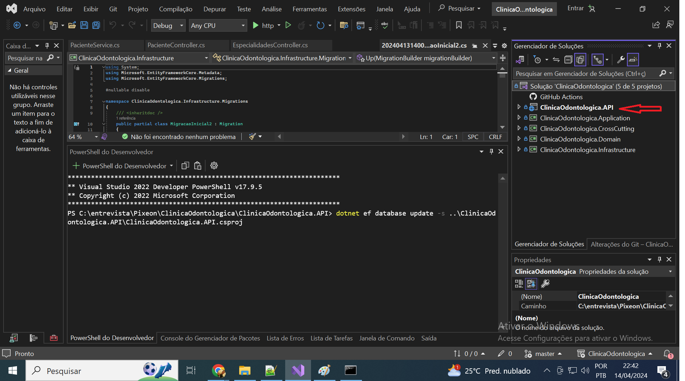
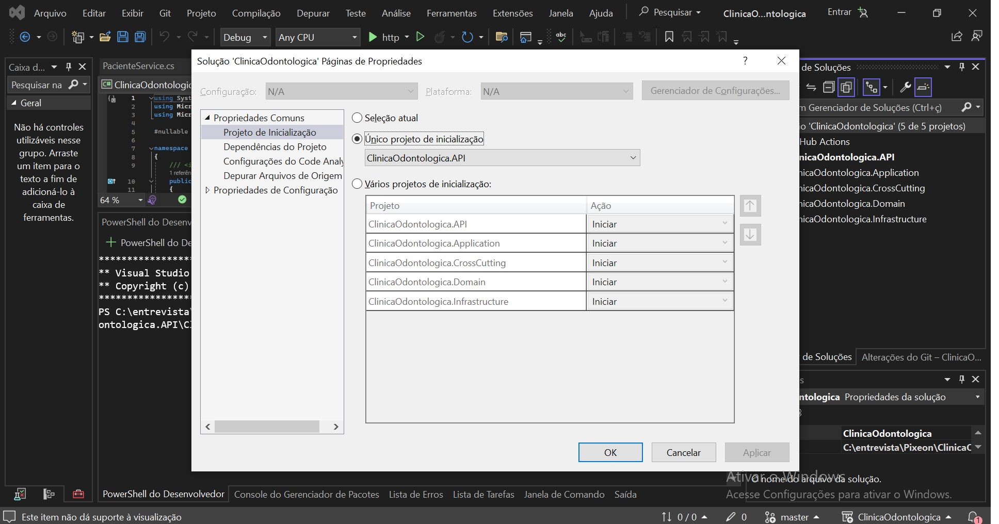

Nesse projeto utilizei a arquitetura clean architecture, com um projeto de API e outros de biblioteca de classes que são:
Application - CrossCutting - Domain - Infrastructure

 - Camada Infrastructure
Na camada de ClinicaOdontologica.Infrastructure possuímos os repositórios, com suas interfaces e implementações.
A IRepository<T> é um contrato de operações genéricas, para diminuir a duplicação de código nas outras interfaces e classes concretas. Nela possuímos a base da comunicação
com o banco e se necessário alguma customização basta inserir diretamente nas classes concretas.

Utilizei ORM Entity Framework, mas a aplicação está configurada para utilizar outro tipo de manipulação de Banco de dados.

- Camada Domain
A classe de domínio, possui as entidades, e não depende de nenhuma outra aplicação, é a parte que representa o negócio, as entidades.
Nesse exemplo teste implementei Especialidade, Paciente e PlanoOdontologico, devido ao tempo não criei as outras entidades disponíveis como Dentista.

- Camada Application
Nela possuímos os DTOs, Interfaces e serviços, mapeamento facilidade de classe DTO para Entidade utilizando o Automapper que facilita esse trabalho no .NET .
Os DTOs possuem validações, e os serviços auxilia na regra de negócio, onde efetuamos validações e retornamos excessões.
Na pasta ValidationErros possuímos as Exceptions que faz com que a aplicação possua excessões personalidadas.

- Camada Cross-Cutting
  É onde efetuamos o registro dos serviços, repositórios, automapper, configuramos o ApplicationDbContext, especificando o banco de dados que iremos utilizar, sua versão e os dados de conexão.
  Nele também poderia estar: Registro (Logging): Registrar eventos do sistema para fins de depuração, auditoria e análise.
                            Autenticação e Autorização: Verificar a identidade do usuário e controlar o acesso a recursos do sistema.
Cache: Armazenar temporariamente dados para melhorar a performance.
Tratamento de Exceções: Manter a integridade do sistema ao lidar com erros inesperados.
Validação Transversal: Regras de validação que se aplicam a vários domínios ou entidades.
Monitoramento: Coletar dados sobre o desempenho e o estado do sistema.
Mas não foi implementado nessa aplicação de teste.
Essa classe tem por objetivo manter a separação de preocupações e evitar o aclopamento excessivo das aplicações.

- Camada API
  Nessa camada possuímos as controllers da API, onde personalizamos os Swagger, configuramos os protocolos GET, POST, PUT, DELETE , injetamos via inversão de dependencia os serviços via Interface.

Nesse projeto não foi implementado os Test unitários, devido ao tempo, mas a aplicação está preparada para esse fim, visto que possui interfaces para que facilite tal teste.

  EXECUÇÃO DO SISTEMA

1 - Baixar do github no .zip ou clonar o projeto na máquina.

2 - Para efetuar o teste, alterar a conexão com banco de dados MySQL no arquivo appsettings.json que fica na ClinicaOdontologica.API

  

3 - Para rodar o Entity Framework para criar as tabelas no banco de dados

	1 - Abra um terminal na pasta ClinicaOdontologica\ClinicaOdontologica.API
	2 - Execute o seguinte comando dotnet ef database update -s ..\ClinicaOdontologica.API\ClinicaOdontologica.API.csproj 
	3 - ele irá ler o migrations que está no projeto Infrastructure e criará a base de dados. 

A Execução do projeto pode ser efetuada de duas formas.

1 - Abra o CMD na pasta ..\ClinicaOdontologica\ClinicaOdontologica.API
2 - Digite dotnet run
3 - verifique a porta que irá abrir como no meu exemplo http://localhost:5199 e inclua o /swagger 
4 - http://localhost:5199/swagger/index.html

Se estiver utilizando o Microsoft Visual Studio

  

Se estiver utilizando o Microsoft Visual Studio

  

É necessário que o projeto ClinicaOdontologica.API esteja configurado para inicialização, se o mesmo não estiver em destaque, conforme imagem abaixo:

Se estiver utilizando o Microsoft Visual Studio

  

Clique com botão direito no projeto, configurar projetos de inicialização.
Na caixa que abrir, selecione em "Unico projeto de inicialização" a opção ClinicaOdontologica.API

  

Após isso basta executar 

